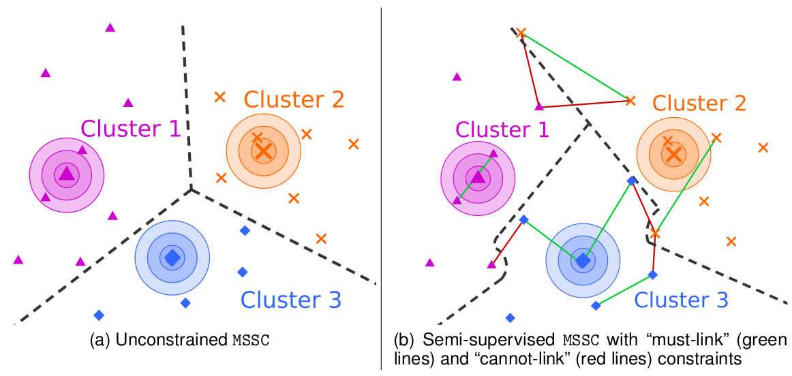

[](https://www.python.org/downloads/release/python-3119/)
[](https://opensource.org/licenses/Apache-2.0)

<p>
  
</p>

## Memetic Differential Evolution Methods for Semi-supervised Clustering

Implementation of the Memetic Differential Evolution methods proposed in 

[Mansueto, P. & Schoen F., Memetic Differential Evolution Methods for Semi-supervised Clustering. arXiv pre-print (2024)](
https://arxiv.org/abs/2403.04322)

If you have used our code for research purposes, please cite the publication mentioned above.
For the sake of simplicity, we provide the Bibtex format:

```
@misc{mansueto2024memeticdifferentialevolutionmethods,
      title={Memetic Differential Evolution Methods for Semi-Supervised Clustering}, 
      author={Pierluigi Mansueto and Fabio Schoen},
      year={2024},
      eprint={2403.04322},
      archivePrefix={arXiv},
      primaryClass={math.OC},
      url={https://arxiv.org/abs/2403.04322}, 
}
```

### Main Dependencies Installation

In order to execute the code, you need an [Anaconda](https://www.anaconda.com/) environment.

#### Main Packages

* ```python v3.11.9```
* ```pip v24.0```
* ```numpy v2.0.0```
* ```scipy v1.14.0```
* ```pandas v2.2.2```
* ```gurobipy v11.0.2```
* ```networkx v3.3```

##### Gurobi Optimizer

In order to run some parts of the code, the [Gurobi](https://www.gurobi.com/) Optimizer needs to be installed and, in addition, a valid Gurobi licence is required.

### Usage

In ```args_utils.py``` you can find all the possible arguments. Given a terminal (Anaconda Prompt for Windows users), an example of execution could be the following.

``` python main.py --dataset Data/synthetic_n500_d2_k20_data.csv --constraints Data/constraint_sets/synthetic_n500_d2_k20_constraints_1000.json --seed 16007 --mutation --P 5 --max_iter 3 --max_iter_ls 25 --verbose ```

The execution results are saved in the ```Results``` folder. In ```main.py```, you can find all the documentation about how the outputs are stored.

### Contact

If you have any question, feel free to contact me:

[Pierluigi Mansueto](https://webgol.dinfo.unifi.it/pierluigi-mansueto/)<br>
Global Optimization Laboratory ([GOL](https://webgol.dinfo.unifi.it/))<br>
University of Florence<br>
Email: pierluigi dot mansueto at unifi dot it
